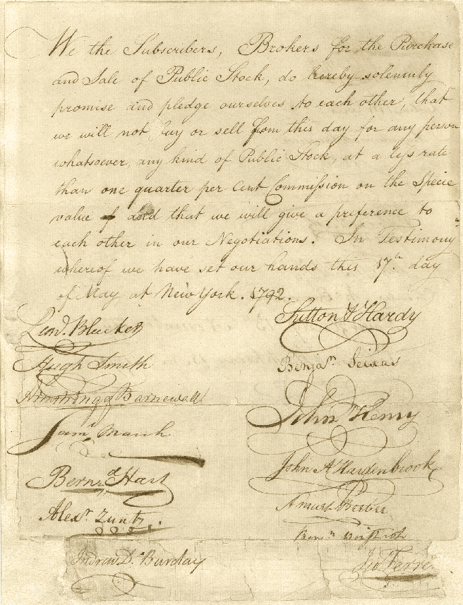
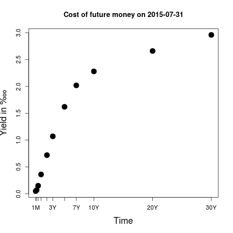

Facts I think "everyone should know". I'll try to keep it short and theory-free. That said, this is an _opinionated_ selection of facts. It will be too obvious for some but hopefully not too advanced for anyone. This is what I wish someone would have told me X years ago. Alternately, if I were teaching a course in economics 101, this is what I would build a course around. This is (a very imperfect and incomplete draft of) what I think would serve the students' rather than the teachers' interests.

I guess this is aimed at something like a 16-year-old or 19-year-old, someone without much life experience who does not deserve to be steered wrong in the self-interest of a professor's career path.

-------------------------

### Money! That's what I want.

<!-- assemble.io/docs/Markdown.html eventually use this to "include" separate files -->

Source: Brad DeLong http://delong.typepad.com/print/20061012_LRWGDP.pdf

Hey, pretty nice. Wealth isn't everything (it's not love or art or fun), but it makes life nicer. And now there's more total wealth? Sweet. How did that happen? And how do we make it happen? And how do _I_ make it happen to _me_?

[[[wealth answer on quora ... land ]]]

### South versus North

The poorest 5 countries in the world are _______ with populations of _.

There are some tiny super-rich countries (more like principalities in size)

After taking them out the richest countries per person are:

The middle country is Mexico.

# capitalism

Libertarians love to cite the following successes of capitalism:

Source: https://books.google.com/books?isbn=1596985453  "Economic logic" http://www.econlib.org/library/Enc/StandardsofLivingandModernEconomicGrowth.html#lfHendersonCEE2-156_table_045 http://www.econlib.org/library/Enc/StandardsofLivingandModernEconomicGrowth.html http://mskousen.com/category/skousen-books/

However let's not stop there. A high average growth rate and high wealth levels aren't everything.

#### Non whites

https://en.wikipedia.org/wiki/Wealth_in_the_United_States#Statistics

† &mu; ≝ mean (average), `m` ≝ median (middle)

‡ the ratio `mean / median` is a measure of dispersion (more total but the middle person doesn't have it)

Race or ethnicity of respondent 	| 1989  | 1989  | 1992 |	1992 |  1995  |	1995 |	1998  | 1998 |	2001  | 2001 |	2004  | 2004  | 2007  | 2007 |	2010  | 2010 |	2013  | 2013
-- | -- | -- | -- | -- | -- | -- | -- | -- | -- | -- | -- | -- | -- | -- | -- | -- | -- | --
White non-Hispanic | 	130.47 |	418.12 |	113.25 |	362.34 |	116.57 |	383.13| 	137.21 |	484.34| 	161.39 |	642.12 |	173.84 	694.21 	192.58 |	777.65 |	139.05| 	695.69 |	141.9 |	696.51
Nonwhite or Hispanic |	11.37 |	117.06 |	19.5 |	126.01 |	23.53 |	117.04 |	23.73 |	143.6 |	23.66 |	154.39 |	30.64 |	189.1 |	31.66 |	257.55 |	21.97 |	188.11 |	18.1 |	184.23

###### Nonwhites = 11, Whites = 130.

http://t.co/SzbNKdgO1x Source: loc.gov

https://ucfbelovedproject.wordpress.com/2012/04/23/sethes-chokecherry-tree/

((separate slavery section? GDP of south and value of slave assets citation))

> I have no accurate knowledge of my age,
never having seen any authentic record containing it. By far the larger part
of the slaves know as little of their ages as horses know of theirs, and it
is the wish of most masters within my knowledge to keep their slaves thus
ignorant. I do not remember to have ever met a slave who could tell of his
birthday. They seldom come nearer to it than planting-time, harvest-time,
cherry-time, spring-time, or fall-time. A want of information concerning my
own was a source of unhappiness to me even during childhood. The white
children could tell their ages. I could not tell why I ought to be deprived
of the same privilege. I was not allowed to make any inquiries of my master
concerning it. He deemed all such inquiries on the part of a slave improper
and impertinent, and evidence of a restless spirit. ―Frederick Douglass, self-taught reader and writer

Source: https://www.gutenberg.org/files/23/23-h/23-h.htm   (who finances Gutenberg?)

((cite self-taught greek/latin cave explorer .. kentucky .. jefferson .. DuPont))

Whoa! Take a few days to ponder those numbers. Non-whites have ______. Non-homeowners have _____. How you like me now?___

[ ^Whites means White Non-Hispanics. Non-whites includes Asians, who have more money than whites; Hispanics (even if they are white), Blacks (the lowest large group, despite some very materially successful blacks [[Ken, William, Ursula]]), Pacific Islanders, Alaskan & Aleutian, and various mainland American Indians, plus "Other Races" (Hmong, .......) ]

http://blackboysreport.org

http://finance.yahoo.com/news/how-chicago-has-used-financial-engineering-to-paper-over-its-massive-budget-gap-144515066.html

http://apps.chicagotribune.com/bond-debt/chicago-bonds.html

> About $54 million from a tax-exempt bond helped cover a legal judgment awarded to African-Americans who were denied a chance to become firefighters by a 1990s entrance exam that favored white applicants. An additional $8 million in tax-exempt bond money went to pay legal fees related to the case, records show.

> By using bond money, the city created an irony for many of those awarded damages, as their future property taxes will help pay interest on the debt. In 2033, when the city starts paying down the $54 million, interest will have more than doubled the total cost.

### Pay

Competitive labor markets are meant to empower workers exactly when employers are forced to pay more. For example:

www.nybooks.com/blogs/nyrblog/2015/jul/25/nail-salons-new-york-times-got-wrong
> My wife has learned that if she is unable to assure her employees that they will earn a total of at least $100 a day, nobody will work for her. 

## Communism

Because of the stark differences between North & South Korea, East & West Germany, Taiwan & 大陆, and pre/post Deng Xiaoping's "opening" of China, you cannot argue that capitalism does not create greater wealth than communism.

Capitalism created wealth in the 20th century. Communism created less and they had access to the same technology. Greater wealth means an easier and more comfortable life. So there is something that we want about capitalism. But what exactly is it? And how much of the bad stuff can we get rid of?

##### "enhanced" capitalism

[[[[pictures of poor people

Long before the crisis of 2008, people have wanted a kinder, gentler capitalism. Does 

You don't need to adopt ad-hoc views about government versus corporate management. There might be some differences between the people who go into one versus the other, but the stereotypes about college sophomore hippies who read Saul Alinsky versus the red-blooded business students who misunderstand Gordon Gekko's purpose in _Wall Street_ (www.youtube.com/watch?v=ArS16ZyOxLQ) ---- are lazy, insufficient guides to characterise government vs business. Both are complex organisations. Both employ lazy risk-haters. Both require layers of communication and compromise. Both work with other people's money. Businessmen often serve on city councils. Etc.

A simpler reason that lawmakers shouldn't delve into the details is that it's too hard. Go to a few city council meetings wherever you live. Ask yourself if you are an expert on par with interested parties in:

- how to insulate a home
- the best kind of fire alarms
- how to design roads safely
- how to encourage both positive & negative feedback from the people you serve when you make the wrong call
- how to 

It ain't easy or fun. And people who critique politicians out of hand for being stupid are lazy non-thinkers. Inform yourself or shut up; you have the internet, so you have no excuse.

I will list several ways that various layers of US federalist government intelligently avoid making decisions they are not equipped to make. The desire to devolve decisions is in my opinion a sign of great intelligence on the part of federal and state lawmakers.

I'll give some examples below.

- exempting municipal bonds from federal tax

# growth & history

http://www.theworldeconomy.org/

> Over the past millennium, world population rose 22–fold. Per capita income increased 13–fold, world GDP nearly 300–fold. This contrasts sharply with the preceding millennium, when world population grew by only a sixth, and there was no advance in per capita income.

> From the year 1000 to 1820 the advance in per capita income was a slow crawl — the world average rose about 50 per cent. Most of the growth went to accommodate a fourfold increase in population.

> Since 1820, world development has been much more dynamic. Per capita income rose more than eightfold, population more than fivefold.

> Per capita income growth is not the only indicator of welfare. Over the long run, there has been a dramatic increase in life expectation. In the year 1000, the average infant could expect to live about 24 years. A third would die in the first year of life, hunger and epidemic disease would ravage the survivors. There was an almost imperceptible rise up to 1820, mainly in Western Europe. Most of the improvement has occurred since then. Now the average infant can expect to survive 66 years.

> The growth process was uneven in space as well as time. The rise in life expectation and income has been most rapid in Western Europe, North America, Australasia and Japan. By 1820, this group had forged ahead to an income level twice that in the rest of the world. By 1998, the gap was 7:1. Between the United States and Africa the gap is now 20:1. This gap is still widening. Divergence is dominant but not inexorable. In the past half century, resurgent Asian countries have demonstrated that an important degree of catch–up is feasible. Nevertheless world economic growth has slowed substantially since 1973, and the Asian advance has been offset by stagnation or retrogression elsewhere.

- delong
- maddison
- homer/sylla
- victorian economy
- viet nam (jeff mcginn)

## the industrial revolution

Was it about technology? Property rights? Limited-liability?

And what do past periods of growth tell us about our service economy and website adventurists in the low-growth 21st century?

### Mastery of Energy

http://web.mit.edu/lienhard/www/ahtt.html

[[[figures]]]

> The life forms on our planet have necessarily evolved to match the
magnitude of these energy flows. But while “natural man” is in balance
with these heat flows, “technological man”1 has used his mind, his back,
and his will to harness and control energy flows that are far more intense
than those we experience naturally. To emphasize this point we suggest
that the reader make an experiment.

> Experiment 1.1
Generate as much power as you can, in some way that permits you to
measure your own work output. You might lift a weight, or run your own
weight up a stairwell, against a stopwatch. Express the result in watts (W).
Perhaps you might collect the results in your class. They should generally
be less than 1 kW or even 1 horsepower (746 W). How much less might
be surprising.

www.youtube.com/watch?v=S4O5voOCqAQ (Olympic cyclist with huge legs cannot toast a piece of toast)

> Thus, when we do so small a thing as turning on a 150 W light bulb,
we are manipulating a quantity of energy substantially greater than a
human being could produce in sustained effort. The power consumed
by an oven, toaster, or hot water heater is an order of magnitude beyond
our capacity. The power consumed by an automobile can easily be three
orders of magnitude greater. If all the people in the United States worked
continuously like galley slaves, they could barely equal the output of even
a single city power plant.
Our voracious appetite for energy has steadily driven the intensity
of actual heat transfer processes upward until they are far greater than
those normally involved with life forms on earth. Until the middle of the
thirteenth century, the energy we use was drawn indirectly from the sun
1
Some anthropologists think that the term Homo technologicus (technological man)
serves to define human beings, as apart from animals, better than the older term Homo
sapiens (man, the wise). We may not be as much wiser than the animals as we think we
are, but only we do serious sustained tool making.

> using comparatively gentle processes — animal power, wind and water
power, and the combustion of wood. Then population growth and defor-
estation drove the English to using coal. By the end of the seventeenth
century, England had almost completely converted to coal in place of
wood. At the turn of the eighteenth century, the first commercial steam
engines were developed, and that set the stage for enormously increased
consumption of coal. Europe and America followed England in these
developments.
The development of fossil energy sources has been a bit like Jules
Verne’s description in Around the World in Eighty Days in which, to win
a race, a crew burns the inside of a ship to power the steam engine. The
combustion of nonrenewable fossil energy sources (and, more recently,
the fission of uranium) has led to remarkably intense energy releases in
power-generating equipment. The energy transferred as heat in a nuclear
reactor is on the order of one million watts per square meter.

So one way to think about then versus now is that the industrial revolution gave us power generation and power consumption. 

#####Electrification the world over

Electrification of the world: data.worldbank.org/indicator/EG.ELC.ACCS.ZS

fuel sources in the us - http://tmblr.co/ZdCxIy13ixiO5

###### The Marcellus Shale

Not everybody gives the discovery and recovery of the Marcellus Shale patch in Pennsylvania the credit it is due for ending the US recession. [^ Geithner does not mention it in his book for example.]

[[[jobs numbers

[[fracking

The US tax code has a separate category for `depletion` so don't think this oil stuff is peanuts.

[[[[figures on size and capital intensity of global oil industry]]]

###### Fuel usage in the US

(Numbers go million, billion, trillion, quadrillion, quintillion, sextillion, septillion, octillion, nonillion, decillion, ..... So quadrillion is 1,000,000,000,000,000. [[[W|A BTU's

Electric power consumption per capita: http://data.worldbank.org/indicator/EG.USE.ELEC.KH.PC/countries/1W?display=graph

(Someone trying to be "interesting" wrote in the 90's a little bit about the history of the dynamo http://www.slate.com/articles/arts/the_undercover_economist/2007/06/the_shock_of_the_new.html and how long it took 

This was due to economic factors, not engineering factors per se. [[[[A standard comment: Increasingly efficient airplanes, cars, and power generators do not necessarily reduce pollution. Because the extra efficiency will lower prices. Lower prices of transport or home/business/farm/industrial electricity will increase usage because of economics. So we can't necessarily solve pollution by better engineering, or at least people will work against us. On the other hand we could not rely on our intelligence to invent superior ways of doing stuff and simply invert the problem: tax electricity and you can reduce usage, without having to invent anything. This has the obvious downside that then you don't get to have as much electricity as you wanted.]]]]

##### Mining, digging, blasting

www.economist.com/node/16846402

# banking

Does finance serve any useful purpose? The first way to argue it does is to think about home loans.

(The bank will repossess your house if you get too far behind on your mortgage. However they will likely take a loss so it is bad for both parties. Otherwise you could expect that banks would loan to whomever. If they could resell the house at face then a mortgage would involve no risk to them so they would just do it as much as possible. [[student loans tkacik]]

Over time consumer credit has expanded into car loans and credit-card loans. [[[frb research on cc debt]]]

- aaron brown on derivatives as the new money
- Tkacik student loans

Any way you slice it, the banking business is about borrowing cheap and lending dear. The economic question is how that goal set affects the rest of us.

## repo markets

Carolyn Sissoko emphasises that lenders prefer to loan against collateral. If you don't pay them back then they get to take your thing.

Treasury bills are considered so secure that they make good collateral. I get money today while you hold my T-bill. If I don't pay you back with interest then you already have my T-bill and don't need to come looking for me. [^ Believe me --- if you've never run a business --- chasing customers down for money _they already owe you_ --- you've already "made the sale" and done the work --- is a huge pain in the ass and a feature of every business. That is why `accounts receivable` is a major accounting category. People try to wriggle out of paying, for real.]

You'll need to think through the [mechanics](https://www.youtube.com/watch?v=1olbQ4LyfFA) a few times before you get it.

- libertystreeteconomics.newyorkfed.org/2011/04/everything-you-wanted-to-know-about-the-tri-party-repo-market-but-didnt-know-to-ask.html
- geithner

According to Tim Geithner's book _Stress Test_, repo is the main way that hedge funds financed trades. The problem with getting financing from the money markets is that, since the terms change every day, you can't count on them too much. Big companies need a department that does nothing but plan and predict treasury financing. In the crisis of 2008 the money markets just stopped offering companies money. Imagine that you are used to borrowing in ranges like 3, 4, or 5 percent and then one day the market was offering 500 percent at best. If your business runs on debt (most public companies do --- see [[LBO]], requires a lender to go through the basic operations of paying your vendors and employees, shipping your packages and            . Maybe for a while you can put people off. But what if the money markets aren't back next week? next month?

This seems like an important feature of today's economic, capitalistic setup. Because of specialisation most companies rely on a lot of other companies to do necessary parts of their business for them. In fact vertical integration is illegal [^ for other reasons]. Imagine that you ran an auto body shop and one day all the people who supply you with paint are gone. You could only serve the customers with the paint you had left. Maybe you talk them into getting a weird color that's "close"? And then what do you do when the paint suppliers are still gone a month later? Do you try to figure out how to make auto paints yourself? This is just one example of [[general equilibrium]] problems: the disappearance of auto-paint suppliers would cause a ripple effect.

[^ Microsoft is an exception [[link]] ]
[Microsoft going to the bond markets](http://www.forbes.com/sites/timworstall/2015/02/10/if-microsoft-has-92-billion-in-cash-then-why-has-it-just-borrowed-10-75-billion/)

(A couple years ago business academics wrote papers about "hoarding cash" ... not coincidentally journalists in major newspapers were talking about "hoarding cash" ... not coincidentally people and their friends were losing theri jobs, fewer people were hiring, and corporate profits were high. Hence, "stop hoarding cash, you big bad corporations".)
https://www.stlouisfed.org/Publications/Regional-Economist/January-2013/Why-Are-Corporations-Holding-So-Much-Cash
http://www.economist.com/news/leaders/21620203-japanese-and-south-korean-firms-are-worlds-biggest-cash-hoarders-hurts-their
[^ In case you didn't notice, "hoarding" is a negatively charged word for "having". ]

# bonds

Every year $__ trillion worth of bonds change hands globally.

For comparison the sum total value of all public companies [^ NB: calculating the price based on the marginal is not really correct because as you tried to sell all of the company's shares, the price might change.] is ~~. And xyzabc changes hands each year.

###### capital structure

Companies are owned by shareholders (equity, which is traded in the New York Stock Exchange [[[pic]]], Frankfurt, ....) 

Some shareholders are mutual funds, pensions, or ETF's. In other words groups that have pooled their money together to own fractions of many companies [^and perhaps own fractions of other things, like forests [[[link]]] or future claims on [[[cow types /// wheat types]]] --- the other things might trade in a different location like Chicago or Kansas City.]

Companies also borrow money. Borrowing = − debt = bonds. Equity = ownership = shares &ne; bonds. Corporate earnings go first to bondholders 

##### sameness and securitisation

In order to bring things to a market they need to be similar. Commodity exchanges for example have a lot of rules about what the delivered product needs to be.

[[[brahmin cows]]]]

[[[gold delivery ]]]

[[[fcoj history ... https://www.theice.com/publicdocs/ICE_FCOJ_Brochure.pdf ... http://www.ultimatecitrus.com/pdf/fcoj.pdf ... brown

Think about rice. Only if the rices are all equivalated somehow can they be mixed together and sold en masse. If they can be mixed together then third-parties can trade it even if they don't want or make rice.

For example wheat traders do not want to take delivery, they simply "make a market" for wheat. Pit traders would aggressively buy and sell slips of paper worth __ bushels of wheat to each other throughout the day, speculating on the ultimate value at delivery.

With things like steel people go to a lot of cost and might actually destroy value, to bring the steel to market. Say you have an awesome steel sculpture. If you can't find someone who agrees it is awesome and sell it to them and deliver it to them, you might melt it down so that its only value is as a commodity.

###### Buttonwood

> Buttonwood Agreement, which took place on May 17, 1792, started the New York Stock & Exchange Board now called the New York Stock Exchange. This agreement was signed by 24 stockbrokers outside of 68 Wall Street New York under a buttonwood tree. The organization drafted its constitution on March 8, 1817, and named itself the "New York Stock & Exchange Board". In 1863, this name was shortened to its modern form, the "New York Stock Exchange".

- the brokers were to deal only with each other, thereby eliminating the auctioneers, and 
- the commissions were to be 0.25%

> We the Subscribers, Brokers for the Purchase and Sale of the Public Stock, do hereby solemnly promise and pledge ourselves to each other, that we will not buy or sell from this day for any person whatsoever, any kind of Public Stock, at a less rate than one quarter percent Commission on the Specie value of and that we will give preference to each other in our Negotiations. In Testimony whereof we have set our hands this 17th day of May at New York, 1792.[1]

Source: Wikipedia

#### information, coördination, competition, and advantage in intra-day trading = dealing = market-making

https://books.google.com/books?id=Rd9hDRR1Yx4C&lpg=PP1&pg=PP1#v=onepage&q&f=true

http://www-bcf.usc.edu/~lharris/Trading/Book/Book-extract.pdf

###### RMBS's

It's this drive to make things exchangeable at a unified trading point that makes it so hard to get a mortgage if you're self-employed. Maybe it is or isn't true that a W-2 job is more stable than the higher-paying 1099 one you have. What is sold on (in packets of 10,000 mortgages at a time [[[link]]) and traded to third-party financial institutions is a conforming mortgage.

Local banks don't need to, themselves, hold enough money to buy every house in town. If they originate conforming mortgages and sell them on to people who *do* have boatloads of money, then they have a repeatable, scalable, fee-based business. Each conforming mortgage is so many dollars. It's a uniform process like an assembly line. It doesn't mean your job isn't valid, just that people who don't fit in the box are harder to pack together and sell as a conforming packet of 10,000.

######Fairness

Is it unfair of them not to loan you money? If I were a conservative I would say it's their prerogative and nobody owes you a loan, however the US has laws that make certain businesses to some extent public institutions. Even if you want to rent a room in your home you are not allowed to discriminate on certain bases. [[[craigslist -- fair housing]]]

Some people like to pretend fairness isn't part of it but in a lawful society it is. We also regulate exchanges and securities offerings. You can't just do whatever you want, sort of like how you can't hire a hit man or tell certain kinds of lies with certain kinds of products. (For example you can lie about supplements all you want, but not about food or drugs.)

In general the law balances freedom with fairness. Capitalism as we know it exists only within a system of laws, and capitalism as we know it has never arisen outside a system of laws. It would be inconceivable to make the kind of money Warren Buffett has made without policies to protect fairly earned wealth. Imagine two boys playing by themselves with no adults around. They make a bet for five dollars. The one who loses refuses to pay and they punch each other. No money is exchanged. This is what I think would happen instead of a carefully regulated system of trust that is necessary for the function of exchanges like the CME. [[[[link to CME stuff

###### labour markets are not markets

If labour markets were like the CME, then you would be able to buy and sell large packs of "work units", let's say 10,000 hours per contract. It would not have to be "generic work". We don't trade "generic cows" or "generic oil" or "generic steel" either. 

For this reason I do not believe "the labour market" is a market in the usual sense of the word.

I've seen market-like things in labour. For example day-labourers will all show up at a an appointed place at 5 in the morning and then scramble for work as whoever that wants "generic manual labour" and can pay cash same-day picks them up in a truck and drives off to the job site. But I think as skills diversify even a little [[[free grou picyture]]] it stops working this way. If you're a flooring expert or an electrician or a journeyman anything, there ceases to be a gathering-market and it starts to look more like the familiar office-work pattern of sending résumés / curriculum vit&aelig; and establishing long-term relationships. [[[insider-outsider dynamic paper link

[[tale of exploitation w/o papers

- recruiter websites
- Indeed / W|A data
- CEO job ads
- professor job ads

###### retail is not a market

Stores in the United States post an offer and you cannot haggle it. Bix box stores contain loads of goods from just one company. Their suppliers may compete with each other but at the consumer end once you're inside Wal Mart you are probably going to buy most of your stuff there. You would have to hoof it across town and you can't see what's in the other store so might as well go with the W. [^ This is a point where I think rationalistic economist models are irrelevant. Rational purchasing may happen over the long run ---- whatever that means --- or it may happen at the supplier level where Wal-Mart squeezes greater profits by muscling against its suppliers. However that is in the back end not at the direct consumer end.]

Stores are also "designed, not emergent". The ladies with the spices can sit wherever they want and readjust throughout the day. The buyer can saunter around. Grocery stores are the complete opposite, they have experts deciding "from the top down" [^fugly 90's speak] what to put next to each other on the shelves.

[[[photo of jojoba]]]

[[[photos of nice retail from my moduli regression post]]]

https://books.google.de/books/about/Wal_Mart.html?id=2ReKQgAACAAJ&redir_esc=y

http://muse.jhu.edu/journals/ens/summary/v010/10.4.bailey.html

http://delong.typepad.com/sdj/2013/02/to-slee-no-one-makes-you-shop-at-wal-mart-chapter-1.html

(Tom Slee is [@whimsley](http://twitter.com/whimsley) on twitter.

In fact market-places are tourist destinations for Europeans and North Americans because we have no markets to speak of. (Bon Marché, despite the name, is not one.)

Source: https://www.happytellus.com/gallery.php?img_id=5683

Try to imagine how people would interact at this *actual* market. Like two gas stations across the street from each other with different prices [[[bertrand competition]]]], I don't think she is going to get away from over charging relative to her friend. Well it depends how good of friends....

(source...)

https://www.flickr.com/photos/gilad_rom/852354376/

Anyway. Is this a more efficient means of social organisation? I am not sure, but I know that Kroger, Tesco's and Wal-Mart are unlike these actual markets.

# Advertising

pepsi/coke fmri

###### lucky strikes

Source: http://www.dailymail.co.uk/news/article-2429980/Mad-Men-sparks-cigarette-sales-boom-Lucky-Strike.html

[[[[old ads website]]]]

What's the difference between Folgers instant coffee and Starbucks instant coffee? Starbucks comes in a tiny packet (not a large can), it's decorated by the favourite small-daily-luxury brand of the median culture, and it's not called “instant coffee”. “Instant” is like pre-sliced bread: it speaks to the atomic-age not to the post-industrial organic age.

Source: https://www.condenaststore.com/-sp/Oh-it-s-the-best-thing-since-small-batch-artisanal-unsliced-bread-New-Yorker-Cartoon-Prints_i9015840_.htm

a_

(NB: After writing this I can't stop singing "The best part of waking up" in my head.)

#### universities 

(most common ad for me to see online. so obviously ... they make money off these ads! will you make money off their product?)

###### FUD / news
https://twitter.com/isomorphisms/status/604712886598922240

###### rappers mentions of Kristal and Err 4ce One's

###### psychological priming

###### Crest 3D White

- surface stains
- http://www.mayoclinic.org/healthy-lifestyle/adult-health/expert-answers/whitening-toothpaste/faq-20058411
- active ingredients
- guarantee (one per person .. get your $3 back)
- answer objections (enamel)
- façade of scientificity (80%)
- "what the customer wants" ((Conwell)) — white teeth (sex appeal, professionalism, are they so different?), not "they won't fall out"

###### hardware stores

- feature marketing
- low prices
- high end (eg jeans)
- freakonomics example

###### Bon Hiver

There are certain stories that always get told alongside a product.

Whenever anyone mentions Alfred Kinsey, they say he was an entomologist _first_ (disarming the notion he was a pervert).

Whenever anyone talks about Bon Iver's album "For Emma, Forever Ago", they mention where it was composed: in a cabin, in Wisconsin, after a breakup. The cabin-in-Wisconsin narrative (it's a little longer than what I said) sticks to your ribs. It stays with you and colours the experience of the album. I don't think the album would have worked as well without the story.

[^ On the other hand, Grey's Anatomy featured the song in the background without context, so what do I know? ]

###### gumdrops

Does the shape of gumdrops matter? Or Hershey kisses?

###### crown royal velvet bag

[[Case study about the packaging

[[[wine labels]]]

[[[beer labels]]]

- diaper labelling company
- digimarc
- inc 5000
- bottling company
- egg carton company

One of the advices they used to give in B-school is to think about B2B because it's a more rational market and larger. Consumers are fickle and hard to predict unless you're really good. Businesses have more definable needs.

## future money
You can check right now here: http://www.treasury.gov/resource-center/data-chart-center/interest-rates/Pages/Historic-Yield-Data-Visualization.aspx

That is the cost of future money. For example on `Sys.Date() == 2015-07-31` the yield on 1-year Treasury notes is `0.36%`, which means that $100 will become $100.36 and $10,000 will become $10,036 in one year's time. If you spent $10,000 on 1-years that day you would receive $10,036 in one year's time.

I am being inaccurate by calling it "future money" but it's close enough.

or http://www.bloomberg.com/markets/rates-bonds has some non-US bonds.

Obviously this is related to inflation (how much money will circulate in the future [[[[velocity]]]]

Here is how that curve has moved over time:

Here's the code to calculate that picture: isomorphism.es/post/101890975168/treasury-yield-curve-from-the-volcker-era-through The source is FRED.

## muni bonds

Cities and counties collect your taxes. They pay for really expensive things like schools, roads, power plants. [[[cost examples]]]

- creditflux
- munilass
- CUSIP's http://emma.msrb.org/
- http://www.breckinridge.com/insights/podcasts.html

##### tax exempt bonds

Who benefits the most from tax breaks? Those who pay the highest tax rate. So the federal government rewards the rich if they invest in communities and localities, without asking legislators to pick winners or do due diligence.

# rich & poor

due to Catherine Mulbrandon: http://visualizingeconomics.com/blog/2006/11/05/2005-us-income-distribution

Notice that:
1. not only do half of the households get by on less than $40k / year, there arearound just a ton of people who (combined, if multiple people work in the home) earn $20k or $30k.
2. the rich live in their own world [^ I think you would need a `log(log($))` scale to fit the rich.]

People who index around $100k or complain about how there exist others who make more money than they do (doctors, corporate lawyers, investment bankers, currency traders, whatever) are living in a bubble. Normal Americans make $20k or $30k. (If you assume full-time work = 50 weeks × 40 hours/week = 2000 hours/year, then that would be $10/hour – $15/hour. Normal.)

There are some reasons the $0/year households aren't dead: they might be retired and living off of savings, or they might have negative business income for the year but generally be rich. [[mpls fed]]

Anyway. It's the $10/hr - $15/hr number that we should be interested in increasing. In a capitalist world that means empowering those people. Their productivity needs to go up and/or they need to capture more of what they already produce.

[[atlanta fed]]

- http://www.equality-of-opportunity.org/
- piketty saez
- Tkacik Vyvanse

# The corporate landscape

People get the things they need and want in life from companies. They earn the paper to buy these things from working at one or a few companies. We have chosen capitalism as the way that things will get done.

### Large firms anyone can buy a piece of

https://en.wikipedia.org/wiki/List_of_S%26P_500_companies

Company | What they do
-- | -- 
Dow Chemical | chemicals
Adobe | pdf
Electronic Arts | video games
Facebook | sell ads to you
Fifth Third Bancorp | originate mortgages

#### working for a large company

###### how many people are employed at small firms?

- wildcatting in the Marcellus shale

# How to be successful

> Rise early, work late, and strike oil.

— John Paul Getty (yes, the Getty of Getty oil

(Getty images?)

By the way, it is a violation of your merchant agreement to charge different prices for cash or credit.

Payment processing

- Braintree
- Authorize.net
- PayPal
- VenMo
- Square
- cash.me
- the other one (Rails people like it?)

###### payments business

###### paypal, mastercard, visa, payment networks

###### fraud (US dept of __)

###### medical devices

###### EY, BDO, PWC: big 4 accounting firms

###### SAP, Oracle, IBM

###### tumblr business model

https://twitter.com/isomorphisms/status/604116555920613376

#### recruiter business

- duffy (cheeky articles)
- returns per fill
- don't need an engineering degree

why is 5 years of experience the magic number?

### Large, privately owned firms

http://www.forbes.com/largest-private-companies/

Company | Yearly Sales | Market Cap | Location | # Emp | What they do
-- | -- | --
Cargill | a | b | Detroit | x | salt mines (sell road salt to cities for the winter)
Bechtel | mining; Halliburton competitor; see [[world bank conspiracy

## SIC codes and NAICS

### forming a corporation

Some losers will call themselves "CEO of [0-employee company]" to try to impress you. It's not impressive. I started a company (by which I mean I filed the paperwork and paid a minimal fee). I had a couple IC's

It used to take an act of Parliament to create a limited liability company (eg, Verenigde Oostindische Compagnie). 

#### IC's versus employees

You can go to jail if you try to 1099 someone who needs a W-2. This is something you need to do our own legal reconnaissance on and take your own risks, but roughly: if you control the means, method, timing, tools, .......

I applied to a job not too long ago that required on their application form that you are OK with them paying an LLC you control. (That way they don't have to file or pay taxes; you have to do that.) I'm not a lawyer but that sounds all kinds of illegal to me. Plus the CEO seemed shady and their application questions were dumb. But anyway, just because you *might* get away with it, you might also spend half a decade in a cement cell with six walls around you and an hour in the sun every day with other convicts. Great time to read books though.

- Illinois dude who flouted the law and went to white collar prison
- Orange County debacle

#### Franchises

http://www.entrepreneur.com/franchises/sportclips/282819-0.html

I saw an ad for SportsClips in Entrepreneur magazine one time (it's a shitty magazine but for some reason cowork spaces like to stock it. I guess it makes them look like everybody else?)

##### Specialty magazines

- Regional Banker magazine

Since as a media owner your job is actually to sell ads, why not just start with a group of people you want to advertise to? Source some shitty articles from shitty writers that are vaguely on topic, figure out how to do glossy printing, and 

#### Government bids

Every customer is different and so is the government. Since governments have the power to tax and since they pool the resources of a community, they often have a lot of money. And they might not be very smart at spending it.

Witness DoD contracts

Witness [[[Medora, Texas

###### Gyms

If you want to sell your gym it will be valued proportional to how many credit cards you have permission to bill each month.

###### Recurring revenues

Recurring revenues are really important to businesses but don't fit the theory models. Serious problem with theory in my opinion.

Check out Dan Davies' article on Medium, and his book.

##### Self-promotey upstarts

http://autopsy.io/

http://tmblr.co/ZdCxIyPwPOui

<pre>
Category	 Started Funded	 %F	∑Raised	 TC Posts
Advertising	 3972	 631	 16	 $8B	 996
Biotech	 	 2787	 1770	 64	 $42B	 43
Cleantech	 1302	 719	 55	 $33B	 192
Consulting	 3330	 176	 5	 $2B	 444
Ecommerce	 5383	 868	 16	 $10B	 1587
Education	 522	 60	 11	 $½B	 90
Enterprise	 2389	 652	 27	 $10B	 993
Games video	 3992	 910	 23	 $16B	 3625
Hardware	 1726	 613	 36	 $12B	 3274
Legal	 	 306	 23	 8	 $0.1B	 16
Mobile	 	 4101	 1099	 27	 $20B	 4263
Network hosting	 1782	 340	 19	 $8B	 1375
Other	 	 33068	 2022	 6	 $24B	 2501
Public relations 2531	 468	 7	 $7B	 765
Search	 	 1437	 226	 16	 $2½B	 4625
Security	 710	 218	 31	 $4B	 135
Semiconductor	 620	 381	 61	 $9B	 27
Software	 12405	 3039	 25	 $33B	 3733
Web              12830	 2401	 19	 $29B	 14356

Category	 Acqu	 %A	IPOs	%I 	% on TC	 Avg Funding
Advertising	 221	 5½	15	½	 6½	 $2M
Biotech	         332	 12	143	5	 ½	 $15M
Cleantech	 72	 5½	39	3	 5½	 $25M
Consulting	 107	 3	15	½ 	 1½	 $½M
Ecommerce	 188	 3½	16	⅓	 12½	 $5M
Education	 4	 ¾	1	¼	 3½	 $1M
Enterprise	 257	 11	41	1½	 9	 $4M
Games video	 285	 7	30	¾	 11	 $4M
Hardware	 139	 8	81	4½	 6	 $7M
Legal	 	 2	 ½	0	0	 1	 $⅓M
Mobile	 	 275	 6½	34	1	 13	 $5M
Network hosting	 154	 8½	22	1	 8	 $4½M
Other	 	 2325	 7	101	½	 2½	 $½M
Public relations 171	 18½	32	1½	 19	 $3M
Search	 	 57	 4	4	¼	 10	 $2M
Security	 96	 13½	12	2	 7	 $6M
Semiconductor	 119	 19	51	8	 3	 $15M
Software	 1101	 9	110	1	 5	 $2½M
Web 		 827	 6½	57	½	 14	 $2½M
</pre>
Source: Smaeer Al-Sakhran

##### Porno and tube sites

- MANWIN
- http://www.businessinsider.com/joanna-angel-burning-angel-2013-9

###### writing a book

"I don't know why everyone doesn't write a self-help book. It's such a lucrative market." ―a self-help guru (cite)

> People only buy books in three categories: lose weight, make more money, and xyz. ―James Altucher (quora .. cite)

###### Commission Junction, spam, and click arbitrage
abc
defg

###### Plenty Of Fish

This story demonstrated to a lot of people that advertising is dumb money. At that point they were paying for page views, so he just made the site worse by giving it more page views.

† Corporations aren't here to serve you the best products that make you happy[^ Although this has become the conventional wisdom of the educated class, because you know, Adam Smith or something. Markets in everything!], they are just sometimes forced to do that through rigorous competition. However there is unbridled competition in websites and PoF was still providing a definitively inferior product to customers yet making more money off of it.

That may have changed now, I think ad measurement is different but ad buyers still have a "monthly spend" as in --- I'm the boss, I delegated to you that you need to _find ways to spend **at least** this amount_ each month, be creative if necessary.[^ But you know, let's still teach Edgeworth boxes because, um. Guess the professors aren't there to serve your interests either? Bingo! Not that they're mean, I think they just have other priorities besides making the prefect truthful relevant class, when it requires fighting against the grain and is not where their bread is buttered. You could argue that it's students' fault for not choosing based on actual academic rigour but rather on how nice the buildings are. ]

##### Professors and education

Professing is a business these days. ((Was it always? Look at Mersenne

# geography

[^ Has it changed much since then? I don't think so, and here's why: [[[pics]]] but if someone has more up-to-date geographic data then we can check.]

- List of 100 wealthiest counties
- Skaneatles Lake
- ↑ spoils of war

due to Catherine Mulbrandon http://visualizingeconomics.com/blog/2014/3/19/average-household-income-by-us-counties

https://twitter.com/isomorphisms/status/608128054842388481

"middle class" https://twitter.com/isomorphisms/status/608126343683940352

### inheritance 

- quora person
- family wealth
- jamie johnson movie
- appanage and the definition of real property

https://twitter.com/isomorphisms/timelines/476938509945962496

#### class is sticky, not nailed down

[[piketty heatmaps]]
- https://twitter.com/isomorphisms/status/458528099697586176 
- 

† By the way, it took only _thirty_ (cite) people to make this database.

> Never doubt that a small committed group can change the world. ---Trotsky (cite)

> I believe great research can change the world. ---Alberto @macrocredit

- non-lazy bakija cole heim

This young man seems to me like a totally nice person—the exact kind you don't want to see pulled in by the "logic" of supposedly hard-headed econ-baiters.

######What's the fastest way to make a million dollars?

Obviously: marry someone with two million dollars. The paperwork for marriage is faster than insurance settlements, because insurance companies will always battle you in court to not give you the money. [[quote]]

You can't sideline inheritance 

It's a fundamental human right to be able to do what you want with your own money. (That's what "your money" is, right?) But actually, no. You can't hire a hitman, nor should you be able to. And the government steps in to take taxes http://www.econtalk.org/archives/2008/05/nye_on_wine_war.html to finance things. And it should do so. [[because..

[[[piketty]]]

[[gregory clarke]]

## rich people in high places

- Merryl Tisch 
- Alfred Nobel
- Cecil Rhodes

poet laureates

