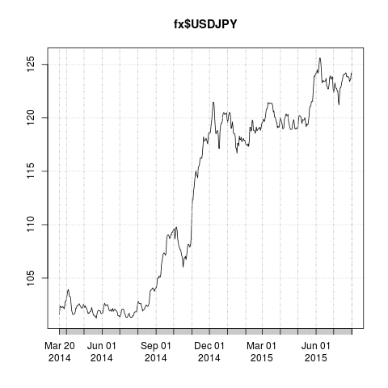

This doesn’t quite fit "stuff everyone should know" but these are some basics that won’t take too too long to quickly gloss over.

# Data and acronyms

#### GDP and PPP

There are some technical definitions to GNP versus GDP which you should look up some day. 

##### Linkage

Everyone's expense is someone else's income. So economics is all about linkages. In a closed system, if there were $100 billion of spending then that would imply $100 billion of output. However things are more complicated since "spending" could be repairing depreciated capital (a recurring cost of roughly 10% per year --- source: Piketty) or investing in new projects that might not go anywhere. It is also complicated by residence and nationality. 

balance of payments

Some countries (think Germany) export more than they import. Things need to 

[[[treasury pic William ... England

A [state-istic] ((link)) made by a mercantile theorist to convince the Bank of England to do something.

#### ECI, CPI, PPP

Although it might not make sense on the basis of individual transactions at constantly adjusting prices, deals struck for incommensurable goods [^no two houses are alike, for example] on ad-hoc terms, for job purpose of statistics advanced nations try to compute "general price levels". This is a hairy business but that is the only way you can get one summary number out of a zillion transactions ((((how many?)))) that take place every year.

billion prices project

###### PPP

There is also a relatively unique price level at which currencies can be exchanged with each other. For example at `abcefg` the conversion between USD and JPY is 124¥:1USD. It did this over the last year:

That price level is not the right conversion to use to compare "general standards of living". Again this is not really a well defined concept because banh mi is better in Viet Nam by construction than anywhere else, and French food is better than English by culture. Houses in the South of France are more regulated in what you can and can't do with them. Etc. Nowhere is the same. But statisticians do at least try to make a better inter-country comparison than just using the spot rate. They compile Purchasing Power Parity numbers every few years which are meant to be used to make better cross-country comparisons. Read about it some time.

 (The alternative is a hamburger index)

## Data

What are the three most important things to know from statistics? They're related.

### Central limit theorem

Sums of flat random draws (a.k.a. "truly random") are not flat. They are mound-shaped. (the middle is more likely than the tails)

Check out John D Cook's post on various central limit theorems. Varying the assumptions you often get a similar story. In the stupidest guise the CLT is known as the "80/20 rule", which is a content-free religious statement you can see everywhere you look if you believe in it, or nowhere if you don't believe in it. Ignore 80/20.

The sum of equiprobable draws needs to be uncorrelated with each other. If two dice are taped together, then each of their rolls considered individually will be flat (even or equiprobable). But their sums would not be mound-shaped, because one die will not be cancelling the other. The dice need to be rolled separately and independently of each other.

(If you need to deal with "dependent random variables", just call a statistician (like me). link to R list. I've written about this elsewhere but let's just not get into it.) An example of correlated RV's could be home price defaults. If one homeowner is in trouble in a company town, it could be because the company is laying people off. Their neighbour's experience is not independent of theirs if they work for that same company: they are at risk of losing their job and defaulting as well.

### Every number is a splotch.

Numbers in the real world [^not in mathematics] usually come with a ± error term. You can think of these like splotches.

[[gaussian pic]]

The number "isn't" exactly 92347. It is around 92347. Is it really close to 92347 or could it actually be quite different?

Here is a good example of (in my opinion) academic shenanigans from a prominent thinker/speaker using people's lack of understanding of splotches.

The books you will find about this will tell you about p-values and H₀ and α and β and Bayesian maximum-likelihood lalalalalala..... Just think of a splotch without a precise shape. It is like a range except the stated value is more likely the ends. Maybe the likelihood is tilted north or south; whatever. Don't worry about moments which are just a way of quantifying the tilt, spread, warp, of where the numbers is "likely" to be. Just know that it doesn't have to be an exact Gaussian shape but it might be roughly mound-shaped.

